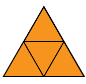
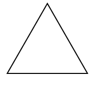
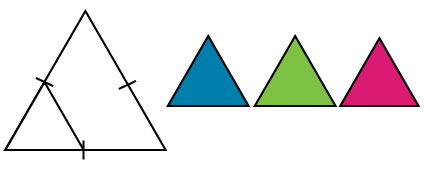
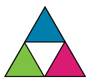
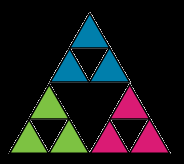

# mandelbrot

# Fractales

## Table des matières

- [Explorez différents types de fractales](#explorez-différents-types-de-fractales)
  - [Table des matières](#table-des-matières)
  - [L'équipe](#léquipe)
  - [Fractales](#fractales)
  - [Contexte](#contexte)
  - [Formes autosimilaire](#formes-autosimilaire)
  - [Triangle de Sierpiński](#triangle-de-sierpiński)
  - [Mandelbrot](#mandelbrot)
  - [Julia](#julia)
  - [Flocon de neige de Koch](#flocon-de-neige-de-koch) 
  - [Burning ship](#burning-ship) 

## L'équipe

3 étudiants en 1ère année de `Bachelor IT spécialité Intelligence Artificielle` à [La Plateforme_](https://laplateforme.io/) à Marseille

- Said Kheloufi
  
  

- Ines Lorquet
  
  

- Bruno Coulet
  
  

## Mode d'emploi

1. Branche main
2. Lancer le fichier main.py
3. Dans la fenêtre qui s'ouvre, selectionner une figure de fractale et cliquer sur "Draw"

## Contexte

“Dans un monde toujours plus complexe, les scientifiques ont besoin des deux
outils : des images aussi bien que des nombres, de la vision géométrique
aussi bien que de la vision analytique.” - Benoît Mandelbrot

### Formes autosimilaire

Les figures à deux dimensions qui sont autosimilaires sont constituées de formes qui sont des copies plus petites de la forme originale. Par exemple :

Les formes autosimilaires peuvent être utilisées pour composer des motifs qui peuvent se répéter indéfiniment.

### Triangle de Sierpiński

Le **triangle de Sierpinski** est un exemple de fractale qui repose sur la forme autosimilaire d’un triangle :

**1.** T = un triangle  
  
**2.** T1 , T2, T3 = 3 triangles de taille réduite (la moitié de la hauteur et de la largeur de T).  
  
**3.** Positionne T1 , T2 et T3 de sorte que deux coins de chaque triangle touchent les deux autres triangles.  
  
**4.** Répète les étapes 2 et 3 avec **chacun** des petits triangles ad libidum.  

Le **triangle de Sierpiński** est un motif fractal formé en répétant ce processus :

- Commencez avec un grand triangle.
- Divisez-le en quatre petits triangles en reliant les milieux des côtés.
- Enlevez le triangle central.
- Répétez ces étapes pour chaque petit triangle restant.

Le motif obtenu est un triangle avec une structure qui se répète à l'infini, de plus en plus petit.

### Mandelbrot

L'ensemble de **Mandelbrot** est une forme fractale complexe obtenue par un processus mathématique. Voici une explication simple :

- L'ensemble de Mandelbrot est défini par la formule : $z^{n+1} = z_n^2 + c$ où $z$ et $c$ sont des nombres complexes. Cette formule est répétée pour déterminer si le point $c$ appartient à l'ensemble de Mandelbrot.

- Répétez l'équation pour voir si la valeur de 𝑧 reste finie ou devient infinie.

- Coloriez le point 𝑐 : Si 𝑧 reste finie, le point appartient à l'ensemble de Mandelbrot et est colorié en noir. Si 𝑧 devient infinie, le point est colorié en fonction de la vitesse à laquelle 𝑧 diverge.

Le résultat est une forme complexe et belle avec des motifs détaillés qui se répètent à l'infini lorsqu'on zoome.

### Julia

Les ensembles de **Julia** sont des formes fractales obtenues par des formules mathématiques. Voici une explication simple :

- Choisissez un point de départ sur le plan complexe.
- Appliquez une formule mathématique (itération) à ce point.
- Répétez la formule plusieurs fois.
- Coloriez le point selon la rapidité avec laquelle il s'éloigne.

Le résultat est un motif complexe et coloré qui se répète à différentes échelles, créant une structure fractale.

### Flocon de neige de Koch

Le **flocon de neige de Koch** est un motif fractal créé en répétant un processus simple. Voici comment il est formé :

- Commencez avec un **triangle équilatéral**.

- Divisez chaque côté en trois **segments égaux**.

- **Remplacez le segment** du milieu par deux segments formant un angle, créant ainsi un petit triangle qui pointe vers l'extérieur.

- **Répétez** ces étapes pour chaque côté nouvellement formé.

En répétant ce processus encore et encore, le bord du flocon de neige devient de plus en plus complexe, créant une forme de flocon de neige détaillée et infiniment fine.

### Burning ship

Le **Burning Ship** est une fractale générée en utilisant une méthode itérative spécifique. Voici les étapes pour générer cette fractale :

- Commencez avec le **plan complexe** : Chaque point sur une grille représente un nombre complexe.

- **Appliquez une formule spécifique** : Pour chaque point $(x, y)$ sur la grille, utilisez la formule itérative suivante :
$[ z_{n+1} = (|Re(z_n)| + i|Im(z_n)|)^2 + c \]$ 
  - $z_0 = 0$
  - $c = x + yi$ est le point complexe
  - $Re(z_n)$ est la partie réelle de $z_n$
  - $Im(z_n)$ est la partie imaginaire de $z_n$
  - $|Re(z_n)|$ est la valeur absolue de la partie réelle de $z_n$
  - $|Im(z_n)|$ est la valeur absolue de la partie imaginaire de $z_n$

- **Répétez l'itération** : Répétez cette formule pour chaque point jusqu'à ce que le résultat s'échappe à l'infini (ou jusqu'à un nombre maximum d'itérations).

- **Attribuez des couleurs** : Les points qui ne s'échappent pas après le nombre maximum d'itérations sont colorés d'une manière spécifique, tandis que ceux qui s'échappent sont colorés différemment.

Le résultat est une image complexe et souvent spectaculaire, qui ressemble à un navire en feu, d'où son nom **"Burning Ship"** (navire en feu).
