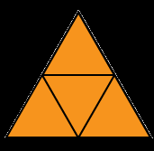

# présente le contexte du projet, les méthodes, employés, une conclusion sur votre travail.

Les figures à deux dimensions qui sont autosimilaires sont constituées de formes qui sont des copies plus petites de la forme originale. Par exemple :

