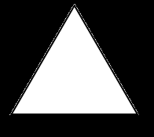
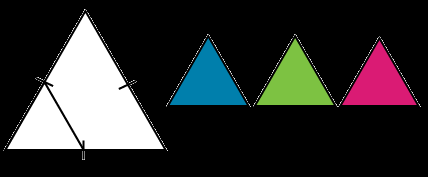
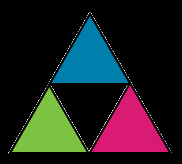

# présente le contexte du projet, les méthodes, employés, une conclusion sur votre travail.

### Formes autosimilaire
Les figures à deux dimensions qui sont autosimilaires sont constituées de formes qui sont des copies plus petites de la forme originale. Par exemple :

Les formes autosimilaires peuvent être utilisées pour composer des motifs qui peuvent se répéter indéfiniment

## Le triangle de Sierpinski
Le triangle de Sierpinski est un exemple de fractale qui repose sur la forme autosimilaire d’un triangle :

1. T = un triangle équilatéral

2. T1 , T2, T3 = 3 triangles de taille réduite (la moitié de la hauteur et de la largeur de T).

3. Positionne T1 , T2 et T3 de sorte que deux coins de chaque triangle touchent les deux autres triangles.

4. Répète les étapes 2 et 3 avec chacun des petits triangles ad libidum.
